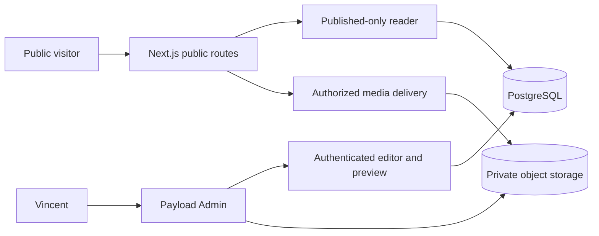

# TRD: Vincent Siauw Portfolio

Tanggal: 15 September 2026 · Status: spesifikasi teknis, belum diimplementasikan

Terkait: [PRD](./PRD.md) · [DESIGN](./DESIGN.md)

## 1. Arsitektur yang dipilih

**Next.js App Router + TypeScript + Payload CMS + PostgreSQL + private S3-compatible object storage.** Public site dan admin berada di satu aplikasi. Komponen halaman dirender di server; client JavaScript hanya untuk kontrol yang membutuhkan interaksi.

Pilihan ini cocok dengan pengalaman Next.js/TypeScript/PostgreSQL pada CV. CMS memakai panel admin bawaan agar implementasi fokus pada konten portfolio. Payload menyediakan versions/drafts dan integrasi preview; konfigurasi serta enforcement tetap harus dikerjakan, tidak otomatis selesai karena CMS dipasang. Lihat [Payload versions](https://payloadcms.com/docs/versions/overview) dan [drafts](https://payloadcms.com/docs/versions/drafts).

Alternatif yang dipertimbangkan: Sanity dapat memisahkan layanan konten dari aplikasi; Markdown mengurangi komponen operasional tetapi tidak memenuhi pengalaman CMS yang diminta. Baseline memilih Payload untuk satu codebase dan kepemilikan schema. Vendor hosting dan biaya belum dipilih.



Gunakan versi stable yang saling kompatibel pada hari implementasi, pin dependency dan commit lockfile. Jangan mengasumsikan semua release Next.js cocok dengan Payload; periksa [installation requirements](https://github.com/payloadcms/payload/blob/main/docs/getting-started/installation.mdx). Dokumen ini tidak menentukan nomor patch yang belum diuji.

## 2. Struktur aplikasi yang disarankan

```text
src/
  app/
    (public)/               # homepage, projects, about, metadata, errors
    (payload)/              # admin dan endpoint CMS sesuai scaffolding resmi
    api/preview/            # entry/exit preview yang diautentikasi
    media/[id]/             # media public yang lolos pemeriksaan visibility
  collections/              # schema dan access rules
  globals/                  # profile dan site settings
  components/               # komponen UI sesuai DESIGN
  lib/content/              # DTO publik, query, sorting, mapping
  lib/auth/                 # preview/session authorization
  styles/                   # tokens dan global styles
  payload.config.ts
migrations/
tests/                      # kontrak akses dan alur kritis
```

Folder adalah rancangan, bukan file yang sudah tersedia. Tidak perlu backend FastAPI terpisah, GraphQL client frontend, Redis, atau microservices untuk MVP.

## 3. Model konten

### Konvensi

- Semua entity: ID CMS, createdAt, updatedAt. Teks trim, batas panjang server-side, urutan integer `sortOrder` ascending lalu ID sebagai tie-breaker.
- Konten editorial: versions dan drafts aktif, `_status = draft | published`. `contentReady` adalah konfirmasi editorial terpisah, bukan status akses.
- Required-for-publish boleh kosong ketika Save draft. Validation hook harus membedakan operasi draft, autosave, restore, dan publish.
- Date bulanan disimpan sebagai `YYYY-MM`, divalidasi kalender. Jangan mengubah bulan karena konversi timezone.
- Rich text menggunakan editor Lexical terbatas: paragraph, h2/h3, ordered/unordered list, link, quote, image/caption, code block opsional. Tidak mengizinkan raw HTML atau arbitrary embeds.
- Relasi hanya mengeluarkan entity published pada DTO publik. Mengisi relationship lewat server tidak boleh membocorkan draft melalui automatic depth/populate.

### Users, collection autentikasi

`email` unik; password/auth dikelola Payload; `role` enum admin, default admin untuk akun yang diprovision secara aman. Tidak ada public signup, tidak ada perubahan role oleh caller anonim. Pembuatan admin pertama lewat mekanisme bootstrap sekali pakai, ditutup setelah akun tersedia. Reset password menggunakan SMTP/transaksional email dengan token kedaluwarsa dan respons generik untuk menghindari enumerasi akun.

### Profile, global editorial

| Field | Tipe / aturan |
|---|---|
| displayName | text, wajib publish, maksimal 80 |
| roleLabel | text, wajib publish, maksimal 100 |
| heroHeading | text, wajib publish, maksimal 110 |
| heroIntro | textarea, wajib publish, maksimal 280 |
| location | text, maksimal 100 |
| shortBio / fullBio | textarea / rich text |
| email | email, wajib publish |
| socialLinks | array `{kind: github|linkedin|other, label, url}`; http(s) tervalidasi |
| resume | relationship Media, opsional, harus public-ready PDF |
| availabilityText | text opsional; tidak default ke Open to work |
| relocationText | text opsional |
| spokenLanguages | array `{name, proficiency}` |
| contentReady | boolean, wajib true untuk publish |

### Projects, collection editorial

| Field | Tipe / aturan |
|---|---|
| title | text ≤100, wajib publish |
| slug | text unik, lowercase kebab-case, reserved words ditolak |
| summary | textarea ≤240, wajib publish |
| category | enum ai-workflows / data-infrastructure / product-engineering / research |
| projectType | enum professional / personal / academic |
| organization | text opsional; jangan menyimpulkan logo permission |
| experience | optional relationship Experiences |
| role | text ≤140; wajib publish |
| startMonth / endMonth | month opsional, end ≥ start |
| context | rich text wajib publish: masalah dan batasan |
| contribution | rich text wajib publish: kontribusi pribadi |
| decisions | rich text wajib publish: keputusan dan tradeoff |
| outcome | rich text wajib publish; naratif boleh tanpa angka |
| metrics | array opsional `{valueText, label, context, sourceNote}`; sourceNote internal |
| technologies | many relationship Skills |
| cover / gallery | Media opsional; gallery dengan caption |
| links | array `{kind: source|demo|article, label, url}` opsional |
| featured | boolean default false; publish guard maksimum 3 proyek featured published |
| sortOrder | integer, default 100 |
| contentReady | boolean default false |
| internalSource / internalNotes | text, admin-only field access |
| seo | `{title≤60, description≤160, image?}`; fallback title/summary |

`sourceNote` merekam provenance metrik, bukan data yang selalu dipublikasikan. `context` metrik harus cukup jelas untuk pembaca. Seed proyek tetap draft walaupun field title/summary terisi.

### Experiences, collection editorial

`organization`, `location`, `workMode` (remote/hybrid/onsite), `sortOrder`, `contentReady`, `internalSource`; array `engagements` dengan `role`, `employmentType`, `startMonth`, `endMonth?`, `isCurrent`, `summary`, `contributions[]`, `technologies[]`, `overlapNote?`.

Validasi: isCurrent true berarti endMonth kosong; selain current harus punya endMonth ketika publish. Dalam satu engagement, end ≥ start. Overlap antarperusahaan diperbolehkan. Offerland menyimpan dua engagement; Tokopedia memuat catatan concurrent yang sesuai CV. Homepage menampilkan role terbaru per perusahaan; About menampilkan seluruh engagement.

### Skills dan Education, collections editorial

- Skills: `name` unik, `group` (languages-frameworks / ai / backend / data / messaging / infrastructure), `sortOrder`, `contentReady`. Tanpa skor persentase. Draft skill tidak muncul dalam proyek publik.
- Education: `institution`, `qualification`, `field`, `startYear`, `endYear`, `gpa?`, `thesisTitle?`, `notes?`, `sortOrder`, `contentReady`. Validasi endYear ≥ startYear; tahun pendidikan bukan tanggal harian.

### Media, collection upload

`file`, `alt`, `caption?`, `kind` (image/pdf), `visibility` (private/public), `contentReady`, `internalNotes?`; dimensi dan ukuran dari metadata file. File default private. Image membutuhkan alt untuk penggunaan bermakna; decorative image harus dinyatakan eksplisit dan tidak menjadi cover default.

MVP menerima JPEG, PNG, WebP maksimum 8 MB dan PDF maksimum 10 MB; validasi MIME serta signature server-side. Tolak SVG/HTML/executable dan double extension yang tidak sesuai tipe. Nama object opaque; nama download CV dapat ramah pengguna. Perubahan visibility perlu mengacu aturan delivery di bagian 5.

### Site Settings, global editorial

`siteName`, `defaultSeoTitle`, `defaultSeoDescription`, `socialImage?`, `footerText?`, `contentReady`. Origin/canonical domain berasal dari environment yang tervalidasi, bukan input URL CMS sembarang. Layout, theme tokens, arbitrary JavaScript, dan custom CSS tidak diedit dari CMS.

### Redirects, system collection

`fromPath` unik, `toPath`, `projectId`, `createdAt`. Dibuat saat published slug berubah, destination internal saja, tanpa siklus. Redirect hanya aktif bila target masih published. Slug historis tidak boleh digunakan proyek lain tanpa resolusi redirect eksplisit.

## 4. Akses dan kontrak query

| Resource | Anonymous | Admin |
|---|---|---|
| Profile/Settings/Projects/Experiences/Skills/Education | Read versi published, field publik saja | CRUD, read draft, preview, publish |
| Users | Tidak ada | Kelola akun sesuai role |
| Versions/internal fields | Tidak ada | Read/restore |
| Private media | Tidak ada | Read/write |
| Public media | Hanya yang public-ready dan direferensikan konten published | Read/write |
| Redirects | Hanya hasil redirect valid | Kelola lewat hook |

Public DTO whitelist: hanya field yang dipakai komponen. Terapkan aturan juga pada endpoint CMS REST/GraphQL yang diaktifkan, bukan hanya halaman Next.js. Nonaktifkan endpoint yang tidak diperlukan bila konfigurasi memungkinkan.

Payload Local API harus secara eksplisit menghormati access control (`overrideAccess: false`) untuk reader publik, menggunakan query published yang sesuai versi. Jangan memakai bypass admin umum untuk mempermudah render. Admin preview membutuhkan user yang tervalidasi; `draft=true` query parameter saja bukan otorisasi. Dokumentasi [Payload drafts](https://payloadcms.com/docs/versions/drafts) menjelaskan bahwa query draft dapat membaca versi terbaru sehingga pembatasan akses penting.

Kontrak query server:

- `getProfile()` dan `getSettings()`: snapshot published atau konfigurasi fallback aman.
- `listProjects({page, featuredOnly})`: published saja, 12 per halaman, sortOrder lalu ID.
- `getProject(slug)`: published detail atau not found; tidak fallback ke draft.
- `getExperiences()`, `getSkills()`, `getEducation()`: published saja, urutan deterministik.
- `getNextProject(id)`: proyek published berikut dalam urutan; entry terakhir tidak perlu tautan berikutnya.

Query server tidak memerlukan public API baru untuk tiap komponen. Bedakan hasil kosong dari kegagalan database; kegagalan tidak boleh mengembalikan fabricated content.

## 5. Publish, preview, dan media

### Baseline konsistensi: render dinamis tanpa shared content cache

Untuk traffic portfolio awal, public content dibaca dari server pada setiap request. Set kebijakan rendering/cache eksplisit sesuai versi Next.js yang dipilih; jangan mengandalkan default framework. Public HTML dan media authorization memakai `no-store`; object bytes boleh disimpan privat di server, tanpa melewati pemeriksaan akses per request.

Konsekuensi: request baru melihat publikasi terbaru segera setelah commit, dengan tambahan query database. Ini sengaja menghindari kompleksitas invalidasi dan kebocoran cache draft. Halaman yang sudah terbuka perlu refresh untuk melihat perubahan. Performa diukur sebelum menambah cache.

Jika kemudian memakai tagged caching, invalidasi harus mencakup homepage, list/detail, slug lama/baru, about, metadata, sitemap, dan relasi. `revalidateTag` dengan profile `max` menggunakan stale-while-revalidate, sehingga tidak cukup untuk janji penarikan konten langsung. Lihat [Next.js revalidateTag](https://nextjs.org/docs/app/api-reference/functions/revalidateTag). Perubahan strategi caching adalah keputusan lanjutan, bukan scope wajib MVP.

### Lifecycle editorial

1. Create → draft, tidak publik.
2. Save draft → simpan versi baru; versi published sebelumnya tetap terlihat.
3. Preview → admin saja, membaca draft tanpa public cache.
4. Publish → validasi field, relasi/media, contentReady; commit versi published.
5. Edit published → lanjut di draft sampai publish ulang.
6. Unpublish → tarik versi publik; permintaan berikutnya tidak menemukan entry.
7. Restore → jadikan versi historis draft, review, lalu publish eksplisit.

Uji behavior actual Payload yang dipilih untuk global dan collections; jangan mengasumsikan `_status` filter saja sudah cukup untuk menjaga snapshot published setelah autosave.

### Preview

Entry preview memverifikasi session admin, collection/ID yang diizinkan, dan tujuan internal. Aktifkan Draft Mode setelah otorisasi; cookie preview tidak cukup tanpa session admin valid pada setiap request. Tidak menerima redirect eksternal. Respons `Cache-Control: private, no-store`, `noindex`, serta `X-Robots-Tag: noindex, nofollow`. Exit preview menghapus mode draft. Detail implementasi menyesuaikan [Payload server-side preview](https://payloadcms.com/docs/live-preview/server).

### Media delivery

Bucket private, tanpa public static upload URL yang memotong access control. `/media/[id]` memeriksa visibility public, contentReady, dan setidaknya satu referensi published sebelum mengalirkan file. Draft-only media hanya melalui route admin/preview terautentikasi. Referensi harus diperiksa pada versi published, bukan draft terbaru.

Image derivatives mengikuti aturan file asal. Jangan membiarkan image optimizer/CDN menyimpan salinan privat atau salinan yang sudah dicabut; MVP memakai derivative yang disajikan melalui pemeriksaan akses yang sama, tanpa shared cache. CV menggunakan content disposition filename aman. Unpublish proyek tidak menarik media yang masih direferensikan proyek published lain.

Media yang sudah diunduh orang tidak bisa ditarik kembali. Ini batas umum publikasi, bukan alasan menunda editing draft.

## 6. SEO, performa, dan aksesibilitas

- Server-rendered HTML untuk isi utama; satu h1 per halaman; heading semantik.
- Metadata per route, canonical origin dari environment, Open Graph title/description/image. Jangan memakai localhost sebagai production canonical.
- Sitemap hanya URL publik dan published. Admin, preview, API internal tidak masuk sitemap; robots bukan mekanisme keamanan.
- Structured data Person memakai identitas/URL yang tersedia; CreativeWork untuk case study bila datanya cukup. Tidak menambahkan rating atau endorsement.
- Self-host font dengan subset Latin, fallback metrics sesuai, `font-display: swap`. Hindari font weight yang tidak terpakai.
- Gambar punya ukuran eksplisit, responsive sizes, lazy load di bawah fold. Tidak ada hero video atau heavy animation library.
- Target lapangan setelah tersedia: LCP ≤2.5s, INP ≤200ms, CLS ≤0.1 pada persentil 75. Ini target, bukan hasil pengukuran.
- Gate pralaunch: Lighthouse mobile performance ≥90 dan accessibility ≥95 pada build produksi representatif; keyboard/manual checks tetap wajib. Catat device/throttle dan route uji.
- Initial JS publik target ≤150 KB gzip per route, di luar admin. Jika lebih, laporkan sumbernya sebelum menambah dependency.
- Kontras normal ≥4.5:1, large text ≥3:1, kontrol/focus ≥3:1; tap target desain ≥44px. Detail DESIGN.

## 7. Security dan operasi MVP

- Session cookie secure pada HTTPS, httpOnly dan sameSite sesuai integrasi; origin/CSRF protections untuk mutasi.
- Rate limit login/reset/upload; validasi semua input server-side. Secret hanya server environment, tidak masuk public bundle atau log.
- Sanitasi link rich text dengan protocol allowlist http/https; email dibentuk dari field email tervalidasi. External links aman dari opener hijack jika membuka tab baru.
- Environment terpisah development/staging/production, database dan bucket terpisah. Preview build tidak otomatis memakai data produksi.
- Environment minimum: DATABASE_URL, PAYLOAD_SECRET, SERVER_URL, object storage credentials/bucket/endpoint, dan SMTP settings. Nama tepat mengikuti adapter saat implementasi.
- Deployment: runtime Node yang mendukung Next.js/Payload, managed PostgreSQL, object storage persisten. Filesystem container tidak menjadi storage permanen upload.
- Migrasi schema versioned; backup sebelum migrasi; rollback aplikasi tidak dianggap rollback database.
- Backup DB dan object storage harian, retention 14 hari sebagai baseline yang harus dicocokkan dengan hosting; target RPO 24 jam, RTO 4 jam. Lakukan satu restore drill sebelum menyebut backup siap.
- Log error dengan request ID tanpa token/password/private body. Health check memverifikasi app dan DB. Admin melihat kegagalan save/upload secara jelas.

## 8. Error dan data state

| Kondisi | Public | Admin |
|---|---|---|
| Loading | HTML server; route pending menampilkan pesan singkat, bukan skeleton screenshot | Loading status dekat aksi; cegah double submit |
| Empty projects | Index menjelaskan belum ada case study; homepage tampilkan experience | Ajakan Add project |
| Database error | Error page dengan Retry, tanpa mengklaim data kosong | Error tetap menyimpan form state sejauh session masih aktif |
| Detail hilang/unpublished | 404; tidak bocorkan judul draft | Admin bisa mengakses draft via preview |
| Upload gagal | Tidak menampilkan broken media | Alasan kegagalan dan retry; form lain tetap ada |
| Clipboard ditolak | Email tetap terlihat/selectable | Tidak relevan |
| Session kedaluwarsa | Tidak relevan | Login kembali, status unsaved jelas |

## 9. Validasi yang harus dilakukan model implementasi

### Integration tests, prioritas tinggi

1. Anonymous tidak dapat membaca draft, versions, internal fields, users, private media melalui seluruh endpoint aktif.
2. Edit published → save draft tidak mengganti output publik; publish menggantinya.
3. Unpublish menghapus list/detail/sitemap dan akses media eksklusif; media shared published tetap tersedia.
4. Preview membutuhkan session, menolak URL eksternal, tidak masuk cache publik, berhenti saat logout/exit.
5. Slug unik, redirect valid, tidak ada loop atau reuse yang membajak URL historis.
6. Publish menolak field kurang; Save draft menerima incomplete content; restore tidak autopublish.
7. MIME/ukuran upload salah ditolak; relasi draft tidak bocor lewat nested fields.

### E2E dan review manual

- Login → draft proyek → preview → publish → edit draft → publish ulang → unpublish.
- Tambah pengalaman dengan dua engagement; overlap Tokopedia/Offerland tetap terbaca.
- Download CV, ganti file, akses file lama sesuai visibility/reference rules.
- Header, pagination, next project, contact anchor, copy email, semua tautan tersedia.
- Keyboard, theme persistence/system changes, 320/390/768/1280px, zoom 200%, reduced motion, long title, missing media, empty list, error route.
- Lint, typecheck, production build, route smoke tests. Catat hasil faktual; tidak ada klaim PASS sebelum dijalankan.

## 10. Definisi siap implementasi dan siap launch

Dokumen ini siap menjadi baseline implementasi tanpa keputusan tambahan tentang layout atau schema inti. Launch membutuhkan akun admin aman, domain dan secrets benar, seed konten ditinjau pemilik, CV publik tersedia bila tombol ditampilkan, serta tes di atas lulus. Biaya aktual dan dukungan hosting harus diperiksa ketika vendor dipilih; tidak ada janji free tier permanen.
